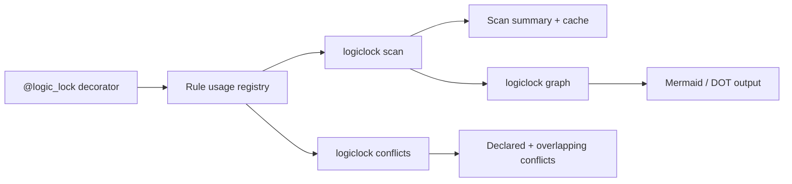

# logiclock

[](https://www.python.org/downloads/)
[](LICENSE)
[](https://pypi.org/project/pylogiclock/)
[](https://github.com/abu-rayhan-alif/logiclock)

Keep rule definitions, decorator metadata, and implementation logic aligned across Python projects.

> Install package: `pip install pylogiclock`  
> Import path: `logiclock`

---

## Why logiclock

- Detect drift between declared rules and implementation behavior.
- Surface conflicting outcomes and overlapping predicates early.
- Generate visual flow graphs (Mermaid/DOT) from Python modules.
- Run incremental scans with cache for large repositories.

---

## Quickstart (1 minute)

```bash
pip install pylogiclock
logiclock --version
logiclock scan .
logiclock conflicts --advanced
logiclock graph tests/fixtures/sample_module.py --output flow.mmd
```

---

## Quickstart (15 minutes, local dev)

```bash
git clone https://github.com/abu-rayhan-alif/logiclock.git
cd logiclock
pip install -e ".[dev]"
logiclock scan .
logiclock conflicts --advanced
logiclock graph tests/fixtures/sample_module.py --output sample_flow.mmd
pytest -q tests/test_ast_parser.py tests/test_graph_export.py tests/test_scanner.py
```

---

## CLI Commands

| Command | Purpose | Exit code behavior |
|---|---|---|
| `logiclock scan [root]` | Scan Python files and print summary (incremental cache aware). | `0` on completion |
| `logiclock validate --format text|json|sarif` | Validate rule files vs decorator metadata. | `1` when errors found |
| `logiclock conflicts` | Detect declared result conflicts. | `1` when conflicts found |
| `logiclock conflicts --advanced` | Include overlapping predicate conflicts. | `1` when conflicts found |
| `logiclock autotest --format text|json ...` | Execute generated scenarios for pure functions. | `1` when scenario failures exist |
| `logiclock graph <module.py>` | Export visual flow as Mermaid or DOT. | `0` on success |
| `logiclock report-sample` | Print sample grouped report output. | `1` in strict mode (contains ERROR) |

---

## Architecture (High-Level)



---

## Scan Options (Performance)

```bash
logiclock scan .
logiclock scan . --workers 4
logiclock scan . --no-cache
logiclock scan . --exclude generated --exclude snapshots
logiclock scan . --rules rules --format sarif
```

- Cache file: `.logiclock_scan_cache.json`
- Default excludes: `.git`, `.venv`, `venv`, `migrations`, `__pycache__`, `dist`, `build`
- Typical behavior: second run is faster because unchanged files are read from cache

---

## Config File (`.logiclock.toml`)

Set default CLI behavior at repository root:

```toml
[logiclock]
exclude = ["generated", "snapshots"]
workers = 4
no_cache = false
scan_format = "text"
rules_path = "examples"
```

---

## Validate Rules vs Decorators

```bash
logiclock validate --trusted-code --rules examples --module examples/django_shop/shop/services/checkout.py
logiclock validate --trusted-code --rules examples --module examples/django_shop/shop/services/checkout.py --format json
logiclock validate --trusted-code --rules examples --module examples/django_shop/shop/services/checkout.py --format sarif
```

Validation reports:
- missing rule for a decorated function
- result mismatch
- missing schema conditions
- unused rules
- each finding includes a short `How to fix` hint

---

## Zero-Code Auto Testing

```bash
logiclock autotest \
  --rule tests/fixtures/autotest/demo_rule.json \
  --module tests/fixtures/autotest/demo_target.py \
  --function apply_discount \
  --trusted-code \
  --format json
```

Opt-in pytest generation:

```bash
logiclock autotest \
  --rule tests/fixtures/autotest/demo_rule.json \
  --module tests/fixtures/autotest/demo_target.py \
  --function apply_discount \
  --generate-pytest tests/generated/test_autotest_demo.py
```

Limitations:
- best for pure functions without DB/network side effects
- Django ORM-bound code may be marked unsafe; prefer generated pytest mode
- use `--allow-unsafe` only when you understand side effects
- `validate` and `autotest` require `--trusted-code` before importing/executing target modules

---

## Rule + Decorator Pattern

Rule file example (`JSON`):

```json
{
  "rule_id": "checkout_discount",
  "conditions": ["user.is_premium", "cart.total >= 100"],
  "result": "discount_applied"
}
```

Decorator usage:

```python
from logiclock.decorators import logic_lock

@logic_lock(
    "checkout_discount",
    result="discount_applied",
    conditions=["user.is_premium", "cart.total >= 100"],
)
def calculate_discount(user, cart):
    ...
```

---

## Graph Export

```bash
logiclock graph path/to/module.py
logiclock graph path/to/module.py --format dot --output flow.dot
logiclock graph path/to/module.py --function my_func --output flow.mmd
```

Notes:
- `module_path` must be an existing `.py` file
- existing output is protected; use `--force` to overwrite
- Graphviz rendering is optional and requires `dot` installed

---

## Framework Coverage

| Framework / style | Example path |
|---|---|
| Django | `examples/django_shop/` |
| DRF | `examples/drf_orders/` |
| FastAPI | `examples/fastapi_limits/` |
| Flask | `examples/flask_checkout/` |
| Celery | `examples/celery_fraud/` |
| Plain Python | `examples/plain_python/` |
| Fintech vertical | `examples/fintech_kyc/` |

See `examples/README.md` for full index.

---

## Installation

| Target | Command |
|---|---|
| PyPI | `pip install pylogiclock` |
| Local repo | `pip install .` |
| Dev editable | `pip install -e ".[dev]"` |

---

## Troubleshooting

| Issue | Recommended action |
|---|---|
| `No module named logiclock` | `pip install pylogiclock` or `pip install -e .` |
| CLI not found | ensure same venv, then run `python -m pip show pylogiclock` |
| First scan is slow | run `logiclock scan .` again (cache improves subsequent runs) |
| ANSI colors in CI logs | use `logiclock --no-color ...` |

Issues: [GitHub Issues](https://github.com/abu-rayhan-alif/logiclock/issues)

---

## Development

```bash
pip install -r requirements-lock.txt
pip install -e . --no-deps
flake8 src tests
pytest tests
```

Optional lock refresh:

```bash
pip-compile --strip-extras --extra dev -o requirements-lock.txt pyproject.toml
```

---

## CI and Release

- CI jobs: lint/test + scan integration workflow
- Trusted publishing workflow for TestPyPI/PyPI is included
- CI recipe templates: `docs/ci-templates.md`
- Benchmark notes: `docs/benchmark.md`
- Release history: `CHANGELOG.md`

---

## GitHub Actions Usage

Dedicated action repo usage:

```yaml
jobs:
  logiclock:
    runs-on: ubuntu-latest
    steps:
      - uses: actions/checkout@v4
      - uses: abu-rayhan-alif/logiclock-action@v1
        with:
          python-version: "3.12"
          install-command: pip install pylogiclock
          scan-command: logiclock --strict --no-color scan
```

Manual steps (without composite):

```yaml
jobs:
  logiclock:
    runs-on: ubuntu-latest
    steps:
      - uses: actions/checkout@v4
      - uses: actions/setup-python@v5
        with:
          python-version: "3.12"
      - run: |
          pip install -r requirements-lock.txt
          pip install . --no-deps
      - run: logiclock --strict --no-color scan
```
